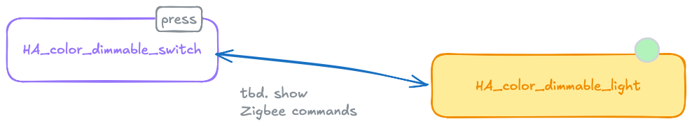

# 2. Demo with two boards (ESP-IDF)

## Requires

- Two ESP32-C6 devkits
- ESP-IDF toolchain

	See [Setting up ESP-IDF manually](1.%20Setting%20up%20ESP-IDF%20manually.md) and follow its instructions.

>🚨 WARNING! The ESP32-C6 multicolored LED can be strong. DO NOT STARE directly at it! The author placed a little sticker on the LED, to diffuse its glow.

## Aim 🏝️

To have the examples

- [`HA_color_dimmable_light`](https://github.com/espressif/esp-zigbee-sdk/tree/main/examples/esp_zigbee_HA_sample/HA_color_dimmable_light)
- [`HA_color_dimmable_switch`](https://github.com/espressif/esp-zigbee-sdk/tree/main/examples/esp_zigbee_HA_sample/HA_color_dimmable_switch)

..working together, ensuring the toolchain works.

### Overview



**`HA_color_dimmable_light`**

- ZR (Router) role

	>Because of `ESP_ZB_ZR_CONFIG` macro

- behaves like a smart light
- receives Zigbee commands; steers a LED

**`HA_color_dimmable_switch`**

- ZC (Controller) role

	>Because of `ESP_ZB_ZC_CONFIG` macro

	- creates the network where `light` can join

- behaves like a light switch

<!--tbd. or in the image
### Messages, protocol
-->

## Steps

### Build the binaries

Build both the binaries, according to instructions in above mentioned doc.

- `HA_color_dimmable_light`
- `HA_color_dimmable_switch`

>You find these in the `examples/esp_zigbee_HA_sample` folder.

>```
$ idf.py build
[...]
[ 98%] Linking CXX executable color_light_bulb.elf
[100%] Built target color_light_bulb.elf
```
>
>```
$ file build/*.bin
build/color_light_bulb.bin: ESP-IDF application image for ESP32-C6, project name: "color_light_bulb", version 4a81abc-dirty, compiled on Mar 22 2026 13:15:54, IDF version: v5.5.3, entry address: 0x408002E6
```


### Launch

#### 0. Reset the flash (both devices)

The Zigbee network is stored in ESP32's non-volatile memory. On your first time (and after problems, perhaps) do this:

```
$ espflash erase-flash
``` 

Do this for both of the devices.

#### 1. Flash the bootloader and partition tables (both devices)

```
$ espflash write-bin 0x0 build/bootloader/bootloader.bin
[...]

$ espflash write-bin 0x8000 build/partition_table/partition-table.bin
[...]
```

Do this for both of the devices.

#### 2. Flash the `switch` application (Controller)

```
$ espflash write-bin 0x10000 --monitor build/color_switch.bin
[...]
I (588) ESP_ZB_COLOR_DIMM_SWITCH: Formed network successfully (Extended PAN ID: fc:01:2c:ff:fe:f9:09:b4, PAN ID: 0x0485, Channel:13, Short Address: 0x0000)
I (1198) ESP_ZB_COLOR_DIMM_SWITCH: Network(0x0485) is open for 180 seconds
I (1198) ESP_ZB_COLOR_DIMM_SWITCH: Network steering started
I (6658) ESP_ZB_COLOR_DIMM_SWITCH: ZDO signal: NWK Device Associated (0x12), status: ESP_OK
I (6658) ESP_ZB_COLOR_DIMM_SWITCH: ZDO signal: ZDO Device Update (0x30), status: ESP_OK
```

The network is now open for 180 seconds, for the `light` application (and device) to join.

#### 3. Flash the `light` application

Flash and launch the `light` example.

The console should show:

```
$ espflash write-bin 0x10000 --monitor build/color_light_bulb.bin
[...]
I (438) ESP_ZB_COLOR_DIMM_LIGHT: Start network steering
W (3578) ESP_ZB_COLOR_DIMM_LIGHT: Network(0x0485) closed, devices joining not allowed.
I (3738) ESP_ZB_COLOR_DIMM_LIGHT: Network(0x0485) is open for 180 seconds
I (3738) ESP_ZB_COLOR_DIMM_LIGHT: Joined network successfully (Extended PAN ID: fc:01:2c:ff:fe:f9:09:b4, PAN ID: 0x0485, Channel:13, Short Address: 0xda51)
```

>Note that the "Extended PAN ID" matches with the `switch`. 

#### Troubleshooting

If you fail to connect, consider:

- have you erased the flash recently?
- reset the devices
- (+ write here, what helped..)

### Play time ⚗️

Press the button labeled `BOOT` on the `switch` device. The color on the other device should change.

Now, remove power from the `light` device for a moment. Reconnect. It should reconnect to the Zigbee network, and the `switch` button should still work.

>To bring back monitoring, `espflash monitor` and `Ctrl-R`.

Do the same for `switch`: OFF and ON.

Notice how the button keeps working - the Zigbee network is resilient.


## Next steps

You can have a look at the [Code Walktrough (C)](3.%20Code%20walk-through%20(C).md) that explains what's happening.


## Notes

**Faster iteration**

If you make changes to the code, it should be enough to just reflash the application binary (last command).

