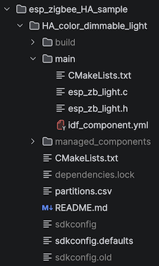

# Code walk-through (C)

Notes on the examples under `examples/esp_zigbee_HA_sample`:

<!--
|||
|---|---|
|`HA_color_dimmable_light`||
|`HA_color_dimmable_switch`||
-->

## `HA_color_dimmable_light`

### Functions

**`deferred_driver_init` (local)**

Makes sure the light driver is initialized. 

**`bdb_start_top_level_commissioning_cb`**

Some callback forwarded further to `esp_zb_bdb_start_top_level_commissioning` (of `esp_zigbee_core.h`).

**`esp_zb_app_signal_handler`**

Handles:

||comments|
|---|---|
|`ESP_ZB_ZDO_SIGNAL_SKIP_STARTUP`||
|`ESP_ZB_BDB_SIGNAL_DEVICE_FIRST_START`|
|`ESP_ZB_BDB_SIGNAL_DEVICE_REBOOT`|
|`ESP_ZB_BDB_SIGNAL_STEERING`|
|`ESP_ZB_NWK_SIGNAL_PERMIT_JOIN_STATUS`|
|other|Logged as `"ZDO signal: {string} ({hex}), status: {string}"`|

**`zb_attribute_handler` (local)**

Receives messages; logs them with `"Received message: endpoint(%d), cluster(0x%x), attribute(0x%x), data size(%d)"`.

If endpoint is us (`HA_COLOR_DIMMABLE_LIGHT_ENDPOINT`), handles following:

|message|comments|
|---|---|
|`ESP_ZB_ZCL_CLUSTER_ID_ON_OFF`|
|`ESP_ZB_ZCL_CLUSTER_ID_COLOR_CONTROL`|
|`ESP_ZB_ZCL_CLUSTER_ID_LEVEL_CONTROL`|

**`zb_action_handler` (Zigbee callback)**

Handles:

|action|comments|
|---|---|
|`ESP_ZB_CORE_SET_ATTR_VALUE_CB_ID`|Calls the `zb_attribute_handler` (above, local); this is the Zigbee callback|

**`esp_zb_task`**

Sets the node up as a Router. Sets up the Zigbee book-keeping and callbacks.

Runs the Zigbee main loop.

**`app_main`**

Prepares the ESP32 hardware (e.g. the NVRAM) and calls `esp_zb_task` (local) for initializing the Zigbee (FreeRTOS) task.

## `HA_color_dimmable_switch`

The code has a very similar structure.

## Headers

Here are the headers used by the two examples above.

### Within the `esp-zigbee-sdk`

**Under `{esp-zigbee-sdk}/components/esp-zigbee-lib/include/`**

||comments|needed for Rust bridging|
|---|---|---|---|
|`esp_zigbee_core.h`|main entry, defines `esp_zb_...` and includes sub-headers `|1|`|yes!|
|`ha/esp_zigbee_ha_standard.h`||yes, `esp_zb_...`; for macros we'll likely need to recreate the code in Rust.|

`|1|` `esp_zigbee_core.h` further includes these:

||path|role|
|---|---|---|
|`esp_err.h`|`{esp-idf}/components/esp_common/include/`|`ESP_OK`, `ESP_ERR_...` macros|
|`zb_vendor.h`|`./managed_components/espressif__esp-zboss-lib/include/`|ZBoss configuration(?)|
|`platform/esp_zigbee_platform.h`|`./managed_components/espressif__esp-zigbee-lib/include/`|Zigbee constants, structs, and some functions.|
|`esp_zigbee_version.h`|`⬆︎same`|Just the component version: 1.6.8|
|`esp_zigbee_trace.h`|`⬆︎same`|tracing|
|`esp_zigbee_attribute.h`|`⬆︎same`|Zigbee attributes and clusters|
|`esp_zigbee_cluster.h`|`⬆︎same`|Zigbee cluster stuff; loooong?|
|`esp_zigbee_endpoint.h`|`⬆︎same`|Zigbee end-point stuff|
|`nwk/esp_zigbee_nwk.h`|`⬆︎same`|Zigbee network layer|
|`zcl/esp_zigbee_zcl_core.h`|`⬆︎same`|Reads *all* Zigbee cluster definitions (not core!!!)|
|`zdo/esp_zigbee_zdo_command.h`|`⬆︎same`||
|`bdb/esp_zigbee_bdb_touchlink.h`|`⬆︎same`|Touchlink values & functions|
|`bdb/esp_zigbee_bdb_commissioning.h`|`⬆︎same`|"How the device gets to the network" (by Copilot)|
|`esp_zigbee_secur.h`|`⬆︎same`|`esp_zb_secur_...()`|
|`esp_zigbee_ota.h`|`⬆︎same`|Over-the-air update -stuff|

### External headers

**Under `{esp-idf}/examples/zigbee/..`**

||comments|needed for Rust bridging|
|---|---|---|
|`light_driver.h`|ESP-IDF component for steering the LED|-| <!-- light_sample/HA_on_off_light/main/ -->
|`zcl_utility.h`|Writing manufacturer info (Zigbee)|maybe, or same logic separately built in Rust|

**Under `{esp-idf}/components/nvs_flash/include/`**

||||
|---|---|---|
|`nvs_flash.h`|Non-volatile memory component|no, use via `esp-idf-svc` or `esp-idf-sys`|

**Under `{esp-idf}/components/esp_common/include/`**

||||
|---|---|---|
|`esp_check.h`|`ESP_RETURN_ON_ERROR` and other macros|no. Rust native error handling|

**Under `{esp-idf}/components/log/include/`**

||||
|---|---|---|
|`esp_log.h`||no. Rust logging, instead.|

**Under `{esp-idf}/components/freertos/FreeRTOS-Kernel/include/`**

||||
|---|---|---|
|`freertos/FreeRTOS.h`||Task stuff; we'll get this via `esp-idf-...`|
|`freertos/task.h`||

*the end*
