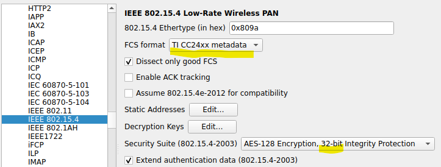

# Using a Zigbee Sniffer (Nordic)

>

*Picture 1. nRF52 dongle*

These instructions cover setting up Wireshark for Zigbee with the Nordic nRF52 dongle (pictured).

It's good if you have read the similar [instructions for Sonoff ZBDongle-E](Using%20a%20Zigbee%20Sniffer%20%28Sonoff%20ZBDongle-E%29.md).

Similarities between the approaches:

- Both are using Wireshark

Differences:

- Nordic Wireshark ExtCap (external capture) adapter needs Python

	- for this reason, we don't install Wireshark directly on Windows 10, but under WSL2.


You can also do a native Windows installation, but that involves installing Python ("3.10 or later") on Windows native. The author wants to not do this.


## Aim 🏹

To be able to follow the Zigbee radio traffic, decrypting messages, helping understand the protocol and debug your own projects.


## Requirements

- PC (Windows 10+ with WSL2); also Linux would do

	```
	> wsl --update
	```
	
	>Simply ensures you have the latest WSL version.

- Wireshark installed on WSL2

	```
	$ sudo apt update
	$ sudo apt install wireshark
	```

	>Note: Wireshark GUI is OS-independent and doesn't look out-of-place when launched from within WSL2.
	
- Nordic nRF52 dongle, or devkit
- nRF Connect for Desktop installed

	This is a "do all" tool for Nordic devkits. Unlike with Sonoff, you'll need it for the firmware flashing. See Appendix A (below), since the experience wasn't quite straightforward!


>Note: Somewhere, it was recommended with such dongles to use a ~30cm USB extension cable for less radio interference from the PC.

- 30cm or longer USB-A extension cable (optional but recommended)


## Steps

>Based on: ["Installing nRF Sniffer for 802.15.4"](https://docs.nordicsemi.com/bundle/ug_sniffer_802154/page/UG/sniffer_802154/intro_802154.html) (Nordic docs; updated May'25)
>
>Hint: The instructions are best viewed as a PDF - there's a link on that page. The author got version 0.7.2.

Please pay attention to the original instructions (above); consider these as simply commentary on top of it.


### Firmware flashing

The vendor instructions ask you to `git clone` a repo, but all you really need is one file, from:

[https://github.com/NordicSemiconductor/nRF-Sniffer-for-802.15.4/tree/master/nrf802154_sniffer](https://github.com/NordicSemiconductor/nRF-Sniffer-for-802.15.4/tree/master/nrf802154_sniffer)

Pick the `nrf802154_sniffer_nrf52840dongle.hex` somewhere.

[Continue here](https://docs.nordicsemi.com/bundle/swtools_docs/page/app/pc-nrfconnect-programmer/programming_nrf52840_dongle.html) for the actual firmware writing instructions!

Note that: the `RESET` button is on the side of that switch. 

Got it flashed? Good!


### Set up Wireshark 4 (WSL2)

**`usbipd`**

In order to "see" the nRF52 dongle in WSL2, you need the [`dorssel/usbipd-win`](https://github.com/dorssel/usbipd-win) service on Windows side. It's generally useful in embedded development, so the author already had it.

```
> usbipd attach --wsl -b 3-1
```

>The bus id for your device depends on the USB port you use. `usbipd list` helps you, here.

After this, on WSL side, you should see:

```
$ lsusb
[...]
Bus 001 Device 003: ID 1915:154b Nordic Semiconductor ASA nRF 802154 Sniffer
[..]
```

>Note: The author already had a sniffer firmware installed. Your text will be different.

**Wireshark settings**

- Add the ExtCap `nrf802514_sniffer.py` to folder `{home}/.local/lib/wireshark/extcap`.

	- See the vendor instructions; path can be seen in Wireshark by: `Help` > `Folders` > `Personal Extcap path`

- Restart Wireshark, to have the adapter take effect

- Add the encryption key(s) <sup>`|2|`</sup>

	- `Edit` > `Preferences` > `Protocols` > `Zigbee`
		- `Pre-configured Keys` > `Edit...`

			|||
			|---|---|
			|Key|`5A:69:67:42:65:65:41:6C:6C:69:61:6E:63:65:30:39`|
			|Byte&nbsp;order|`Normal`|
			|Label|`ZigbeeAlliance09` (this one is just visual reminder)|

			>ESP-IDF examples use this key for their channel encryption (as mentioned in Espressif's doc - and the source code).

	
- Edit the `Protocol` > `IEEE 802.15.4`: <sup>`|2|`</sup>

	

	>Not sure if those are needed.


## Conclusion

Wireshark should now be capable of sniffing Zigbee communication between your ESP32-C6 devices.

Please see the [Sonoff document](Using%20a%20Zigbee%20Sniffer%20%28Sonoff ZBDongle-E%29.md) for recording Zigbee traffic.

>tbd. make three documents?
>
>- Setup (Sonoff)
>- Setup (nRF52)
>- Using Wireshark for Zigbee sniffing  // which would delegate the setup part for the upper two.


## Appendix A. Install nRF Connect for Desktop

The author did this for Windows 10 Home.

>WARN: The installation is not too smooth! This may be because of the version used (Mar'26); there is **no reason** Nordic wouldn't iron out the user experience.

Quirks:

- The JLink installer (separate, but launched by the main one) brings a **version that's not good enough for the tool itself**. This becomes known soon, and nRF Connect for Desktop points you to JLink's site to get a later version (V928 is okay). However, this is **two binary downloads** and **both the versions remain** on the PC, unless you manually remove one. Strange!!!

	Work-around:

	- Install JLink from [their page](https://www.segger.com/downloads/jlink/) prior to installing nRF Connect for Desktop?

	<!-- flashing does need JLink; cannot opt out from it. -->

- After installing the tool itself, its sub-applications still need a separate `Update`. Update at least the `Programmer`.

- When selecting a device, it's unnecessarily non-collapsed in the UX. You need to press a `v` to see your device.

Other than this, the nRF Connect for Desktop seems like a useful and integrated tool. For merely flashing a firmware, it is overkill - as evidenced by Sonoff's approach of simply using a browser (no installs!!).


## References

- Nordic

	- `|1|`: ["nRF Sniffer for 802.15.4"](https://www.nordicsemi.com/Products/Development-tools/nRF-Sniffer-for-802154) (Nordic website)

		- [actual guidance](https://docs.nordicsemi.com/bundle/ug_sniffer_802154/page/UG/sniffer_802154/intro_802154.html) (Nordic docs; updated May'25)

- Espressif

	- `|2|`: Developing with ESP Zigbee SDK > Debugging > <br />[Sniffer and Wireshark](https://docs.espressif.com/projects/esp-zigbee-sdk/en/latest/esp32c6/developing.html#sniffer-and-wireshark) (Espressif docs)

	>This e.g. shows that the Espressif examples use `"ZigbeeAlliance09"` key for packet encryption.	