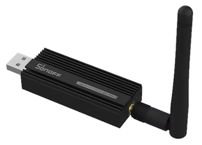
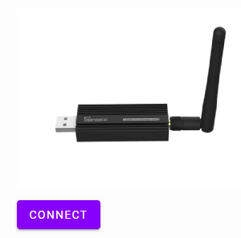
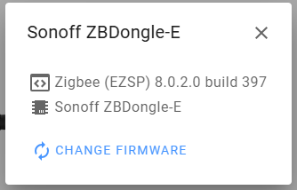
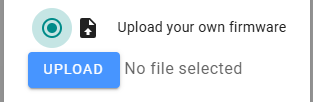
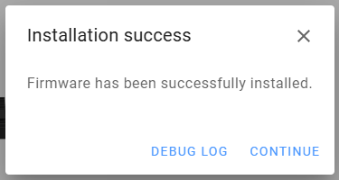
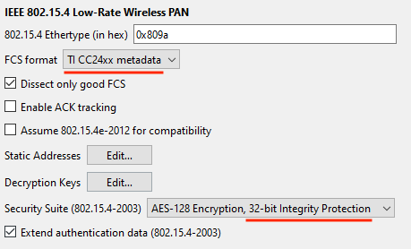
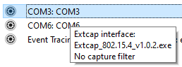
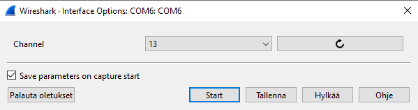
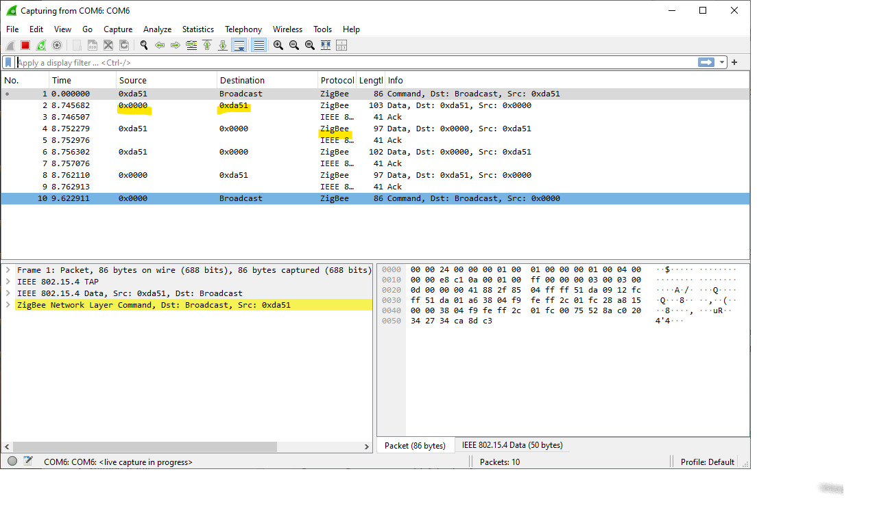

# Using a Zigbee Sniffer (Sonoff ZBDongle-E)

>

For the SONOFF dongle (pictured), the sniffing instructions are nicely in the [same repo](https://github.com/ErkSponge/Sniffer_802.15.4_SONOFF_USB_Dongle_Plus_E). **Please read the repo before proceeding.**

>Note: "SONOFF Zigbee 3.0 USB DONGLE Plus-E" is the same as "SONOFF ZBDongle-E" (marked on the device).

## Aim 🏹

To be able to follow the Zigbee radio traffic, decrypting messages, helping understand the protocol and debug your own projects.

## Requirements

- PC (Windows 10+ or Linux)
- Wireshark installed
- Sonoff ZBDongle-E stick (Zigbee 3.0); gets reflashed

	>Note: Updating the Sonoff firmware is a real breeze. You can do it from a browser. ☀️👏 (at least Edge, on Windows)

- 30cm or longer USB-A extension cable (optional but recommended)

<!-- Author used:
- Wireshark 4.6.4 (Windows 10)
-->

## Steps

### Firmware flashing

- Pick the `Sniffer_802.15.4_SONOFF_USB_Dongle_Plus_E.gbl` file from [the repo](https://github.com/ErkSponge/Sniffer_802.15.4_SONOFF_USB_Dongle_Plus_E/tree/main/Output/Sniffer_802.15.4_SONOFF_USB_Dongle_Plus_E)
- Visit [https://darkxst.github.io/silabs-firmware-builder](https://darkxst.github.io/silabs-firmware-builder) (mentioned on the repo), with Edge or Chrome browser
   - attach the SONOFF device
   - press `Connect`

		Below are screen shots of the process.

		>
		>
		>
		>

		

				
		>Please note the text that mentions about needing an "older driver" depending on your device's serial number.

	- remove the dongle

<!-- nah
Perhaps you want to label the dongle as "Sniffer", to know what firmware it has? 
-->

The dongle is now ready to be used. Let's proceed to set up Wireshark for using it.

### Wireshark Extcap

For Windows, the repo provides a `.exe` file. This is WELCOME, since it means you don't need to install Python on Windows.

>Hint: If you feel uneasy about downloading a `.exe` file, consider setting up Wireshark on WSL2 instead. The repo provides good instructions! (i.e. Linux)

- Pick the `Extcap_802.15.4.exe` file
- Locate the Wireshark "Extcap path", as informed in the repo

	For the author, it was `C:\Users\{me}\AppData\Roadming\Wireshark\extcap`.

	>Hint: Double click on the folder name to open it.	
	- Place the `.exe` in the said folder.

>Close wireshark once the copy is done, the Extcap will be loaded the next time wireshark is started.

### Wireshark keys

>You did restart Wireshark, right? Nice.

To be able to decypher Zigbee messages, we need to edit some Wireshark settings. `|2|`

- `Edit` > `Preferences...`
	- `Protocols` > `Zigbee`

		- `Preconfigured keys` > `Edit...`

			|||
			|---|---|
			|Key|`5A:69:67:42:65:65:41:6C:6C:69:61:6E:63:65:30:39`|
			|Byte&nbsp;order|`Normal`|
			|Label|`ZigbeeAlliance09` (this one is just visual reminder)|

			>ESP-IDF examples use this key for their channel encryption (as mentioned in Espressif's doc - and the source code).

	- `Protocols` > `IEEE 802.15.4`

		Espressif doc also shows two things to change here:
		
		>

		Not sure if these matter - but you've been told. :)

After such settings, Wireshark should be ready for recording Zigbee traffic!

### Recording

- Set power to the `light` and `switch` ESP32-C6 devices.
	- ..test that their button / light comms still works

- insert the dongle

You should now see two `COM` ports that identify as the sniffer:

>

Click the **gear icon** (that looks like a radio button, left of the `COM`  name) for `COM6` (or whichever is your larger port number). Let's configure it for channel 13 (what we know the Espressif examples to use).

>

Press `Start` and... you should see some traffic from your `light` and `switch` devices!!!

## Tips on using Wireshark

The author just started. 

I'm sure I'll collect a bunch of do-this-don't-that, but at the moment, you have the tools set up; you're able to play with them!  Have FUN!!! 🎊🪄

## Troubleshooting

### Use a USB extension cord

Zigbee dongles kind-of work when connected directly to one's PC. They work better when being 30cm (1ft) away from it. 

### Windows Drivers

>"You may need updated CP210x USB-to-UART bridge drivers." (google.ai)

## References

- Espressif

	- `|2|`: Developing with ESP Zigbee SDK > Debugging >  [Sniffer and Wireshark](https://docs.espressif.com/projects/esp-zigbee-sdk/en/latest/esp32c6/developing.html#sniffer-and-wireshark) (Espressif docs)

	>This e.g. shows that the Espressif examples use `"ZigbeeAlliance09"` key for packet encryption.	