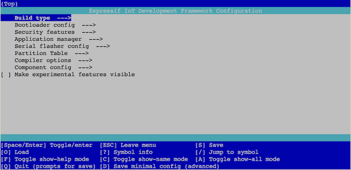

# Understanding `menuconfig`

The `_mc` folder is separate from the rest of the repo.

The purpose is to be able to study and fine tune the ESP-IDF *configuration* used in building the Rust projects.

<!-- tbd. image
-->

## Roles of files

**`sdkconfig.defaults`**

This file gives the *intention* of the author, for which ESP-IDF capabilities should be activated, and which banned. **It DOES NOT STEER** the build: one cannot e.g. state "WiFi disabled", if there's some enabled component that brings it in.

It's a ... kind request.

**`sdkconfig`**

This is the *output* file somewhere under `target`:

```
$ find ~/target -name sdkconfig
/home/ubuntu/target/riscv32imac-esp-espidf/release/build/esp-idf-sys-d65dd9544361a2df/out/sdkconfig
```

>Note: Your `target` might be in the local folder, without a tilde.

This lists *all* the configuration for ESP-IDF and has thousands of lines. **IT IS IMPORTANT** that you understand how to query it manually - and how to potentially edit it, with `menuconfig` tool.

```
$ cat `find ~/target -name sdkconfig` | grep VFS_
CONFIG_FATFS_VFS_FSTAT_BLKSIZE=0
# CONFIG_VFS_SUPPORT_IO is not set
```

Here we manually checked that the `VFS` (virtual file system) is off.

>Try the same for `ZB_` (should find some; Zigbee specific), `BT_` (Bluetooth) and so forth.

## Using `menuconfig`

`menuconfig` is an ESP-IDF tool that allows you to *hierarchically view* a set of configurations.

Using it:

- ensures you would not make a typo, typing config entry names
- allows you to get an understanding of the *dynamic nature* of the configuration


### Requirements

- A working ESP-IDF 5.5.4 installation

	Make sure it's the same version as the one `esp-idf-sys` brings in.
	
	```
	$ idf.py --version
	ESP-IDF v5.5.4
	```

	>Note: The author uses separate VM's for the Rust (`esp-idf-sys`) and ESP-IDF environments.


### Prep

```
$ idf.py set-target esp32c6
```

This is **important**. You need to set the target MCU within the project folder.

>`_mc` is akin to a traditional ESP-IDF project folder.


### Launching

You can either copy the `sdkconfig` file (from `target` output, see above) to the `_mc` folder, or point to it with the `ESP_IDF_SDKCONFIG` env.var.

```
$ ESP_IDF_SDKCONFIG=../sdkconfig idf.py menuconfig
```

If the launch is good, you will see:

```
NOTICE: [1/3] espressif/esp-zboss-lib (1.6.4)
NOTICE: [2/3] espressif/esp-zigbee-lib (1.6.8)
NOTICE: [3/3] idf (5.5.4)
```

This means the external components have been included in the configuration.



The interesting part is often under `Component config`.

- 👉 Learn to use the keyboard commands:

	- `C` "toggles show-name mode"
	- `/` "jump to symbol"

It should be fairly easy from here...

<!-- nah
### Interesting keys

- `Component config` > `Zigbee`

	The keys for our `esp-zigbee-lib` external component.
-->

## Advanced

### 🤔Hint: speed up `menuconfig` on Multipass VM's

If you are using Multipass VM, you might speed up the launch 5..10x by:

```
$ install -d /tmp/mc-build
$ ln -s /tmp/mc-build build
```

This keeps the build files (26MB of them) within the VM, without sharing them with the host.


### `idf.py reconfigure`

If you "mess up", or e.g. edit the project files (within `_mc`), you can refresh the configuration seen by:

```
$ idf.py reconfigure
```

This was necessary in development.
