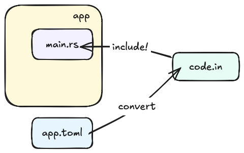

# `ezb-node-config`

This library aims to simplify `ezb-node` applications, by making their configuration *declarative*, in a TOML file.

## Two faces

### Building

Your application's `build.rs` converts the TOML into a code snippet. This happens within the *host* target.

### Runtime

Your actual application code includes the configuration as a read-only struct.

---

This arrangement combines *type safety* (of Rust) with the apparent ease of writing a TOML.

## Documentation

See the examples for working TOMLs.

