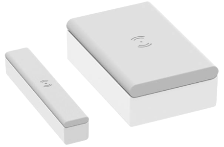

# Demo 2

First read the `../../README.md`.

For the commands provided below, remain in the `apps` folder.


## Requirements

- 1 pc ESP32-C6 devkit
- 1 pc Schneider Electric / Wiser [Door/window sensor CCT591011](https://www.zigbee2mqtt.io/devices/CCT591011_AS.html)

	

- 1 pc pin (or pen) for pressing the Reset button


## Steps

### 1. Prepare the sensor

First, bring the sensor close (~ 1m) to the devkit, for pairing.


### 2. Launch the application

```
$ just door-run
...

```

When the application is in binding state:

- triple press the "Setup/Reset" button, on the bottom side of the sensor

	- its LED should start blinking in orange 🟧


Once the device joins, the LED should remain green 🟩 for a moment.


## References

- ["Wiser Window/Door sensor"](https://productinfo.se.com/wiser_home/wiser-window-door-sensor_wiser_home_device-user-guide/English/Wiser%20Window_Door%20Sensor_Wiser_Home_Device%20user%20guide_0000802479.xml/$/WiserWindow_DoorSensor_Wiser_HomeCPT_0000802539) (Schneider Electric)

	- ["Led indications"](https://productinfo.se.com/wiser_home/wiser-window-door-sensor_wiser_home_device-user-guide/English/Wiser%20Window_Door%20Sensor_Wiser_Home_Device%20user%20guide_0000802479.xml/$/LEDIndicationsCPT_0000661246#LEDIndications-C4E8250E)


## Appendix 1. TL;DR

To work with the sensor:


Technical data:

- battery life stated: "up to 5 years"

